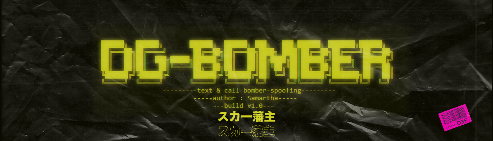
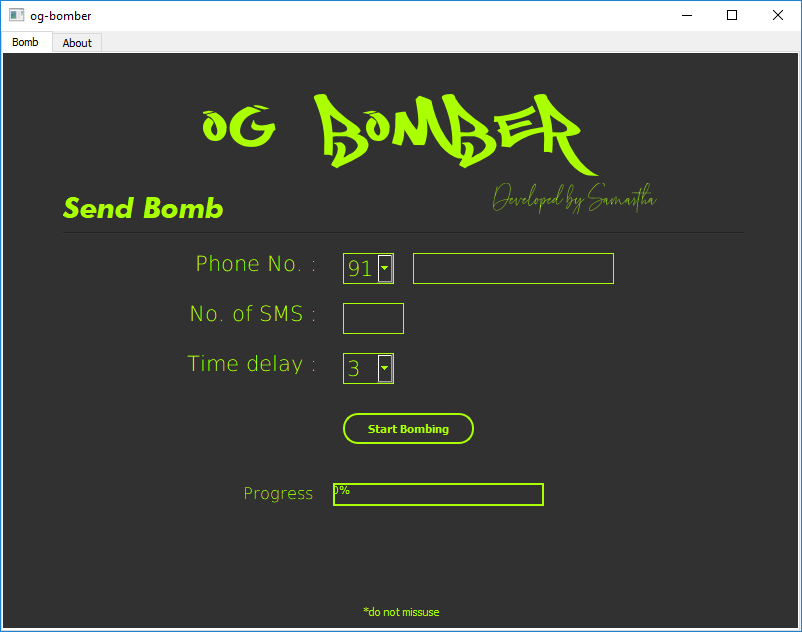

# og-bomber-gui

`stable build v1.1`

### message spoofing | bombing victims with otp texts

> Built with python 3.x.x

> Grapical User Interface Application

[](https://github.com/yunghog/w3bsite13locker)
[](https://github.com/yunghog/w3bsite13locker)
[](https://paypal.me/samartha890?locale.x=en_GB)
[](https://pypi.org/project/selenium/)
[](https://phantomjs.org/download.html)
[](https://pypi.org/project/PyQt5/)

## Table of Contents
- [Requirements](#requirements)
- [Installation](#installation)
- [Features](#features)
- [Usage](#usage)
- [Snapshot](#snapshot)
- [Support](#support)
- [Contributing](#contributing)
---
## Requirements
> python 3.x.x

> [selenium 3.x](https://pypi.org/project/selenium/)

> [requests](https://pypi.org/project/requests/)

> [PhantomJS](https://phantomjs.org/download.html)

> [PyQt5](https://pypi.org/project/PyQt5/)

### Installing PyQt5
PyQt5 can be installed by the command
```shell
pip install PyQt5
```

### Installing Selenium
Selenium can be installed by the command
```shell
pip install selenium
```

### Installing Requests
Requests can be installed by the command
```shell
pip install requests
```

### Installing PhantomJS
- PhantomJS can be dwonloaded from [here](https://phantomjs.org/download.html)
- After downloading the zip, extract zip.
- Place the contents in windows drive. Linux users can skip this step
- Add bin folder to the system path
- Anaconda users can install directly by using command
```shell
conda install -c conda-forge phantomjs
```

## Installation
- clone the repo into any directory using url : https://github.com/yunghog/og-bomber-gui.git
```shel
git clone https://github.com/yunghog/og-bomber.git
```
- open clonned directory
- run `setup.py` using command
```python
python setup.py
```

## Features
<p>OG-BOMBER is a unique message spoofing tool unlike any other message spoofing tool. We register the users and store all the
details of the spoof to ensure there is no misuse. To limit the usage there is a quota beyond which you cannot spoof no more
We even keep the record of the victims phone number. There are two type of subscription FREE and PREMIUM. Free users will have a
quota of 200 sms/day and Premium will have unlimited sms. BLACKLISTING service is available for Premium members. You cannot spoof a Blacklisted number, so they are safe. Become a Premium member by <a href="https://www.paypal.me/samartha890?locale.x=en_GB">Donating</a></p>

## Usage
- To start spoofing run `ogBomberGui.py` using command
```python
python ogBomberGui.py
```
- Enter victim number, no. of sms in the command line prompt and hit enter
- Sometime the server may not respond, you may have to try again later

## Snapshot
- `setup.py`


## Support
- [Buy me a coffee ☕🍪](https://paypal.me/samartha890?locale.x=en_GB)
- [Help me to contribute more !](https://paypal.me/samartha890?locale.x=en_GB)

## Contributing
- 🍴 Fork this repo!
- 👯 Clone this repo to your local machine using `https://github.com/yunghog/og-bomber-gui.git`
- Pull requests
